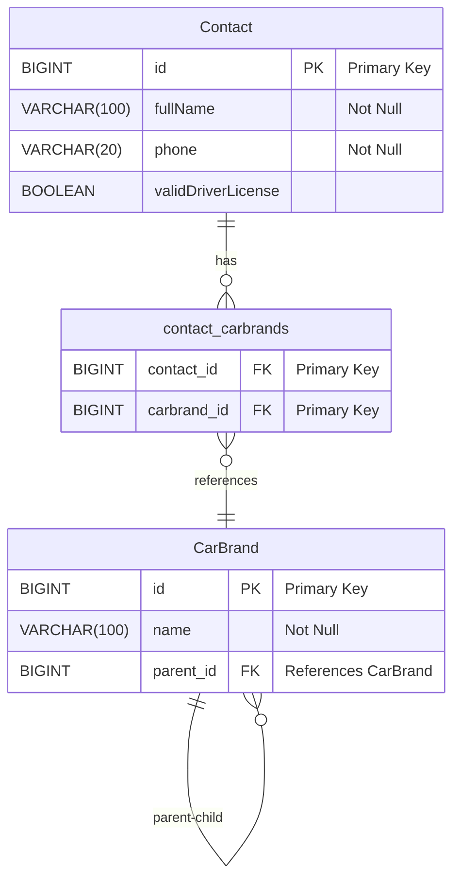

# Autokontakt

Simple web application for collecting contact information and car brand preferences.

## Prerequisites

* Java JDK 21 or newer ([Eclipse Temurin JDK](https://adoptium.net/temurin/releases) or [Oracle Java JDK](https://www.oracle.com/java/technologies/javase-jdk21-archive-downloads.html))
* [Apache Maven](https://maven.apache.org/download.cgi)

## Installation

1. Clone the repository:
```bash
git clone https://github.com/MarkoNiitsoo/autokontakt.git
cd autokontakt
```

2. Build with Maven:
```bash
mvn clean install
```

## Running the Application

Development mode:
```bash
mvn spring-boot:run
```

Production mode:
```bash
java -jar target/autokontakt-0.0.1-SNAPSHOT.jar
```

The application will be available at `http://localhost:8080/contact`

## Features

* Contact form with validation
* Hierarchical car brand selection
* Session-based data modification
* H2 database for data storage

## Data Model



## Technologies Used

* Spring Boot - Web application framework
* Thymeleaf - Server-side template engine
* H2 Database - In-memory database
* Maven - Dependency management and build tool

## Documentation

For detailed documentation, please see [dokumentatsioon.md](src/dokumentatsioon.md)
