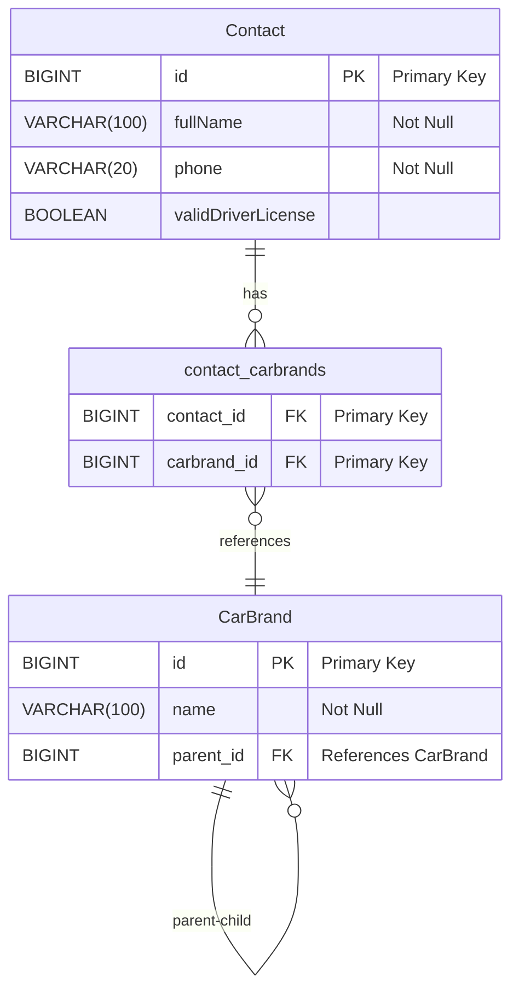

# Proovitöö dokumentatsioon: Autokontakt

## Sisukord

1.  [Paigaldusjuhend](#1-paigaldusjuhend)
2.  [Kasutusjuhend](#2-kasutusjuhend)
3.  [Andmemudel](#3-andmemudel)
4.  [Valitud raamistike põhjendused](#4-valitud-raamistike-põhjendused)
5.  [Git commit ajalugu](#5-git-commit-ajalugu)
6.  [Tagasiside proovitöö ülesande kohta](#6-tagasiside-proovitöö-ülesande-kohta)
7.  [Ajahinnangu tagasiside](#7-ajahinnangu-tagasiside)

---

## 1. Paigaldusjuhend

Selles juhendis kirjeldatakse, kuidas paigaldada ja käivitada "Autokontakt" rakendus.

### 1.1 Eeltingimused

Enne paigaldamist veendu, et sinu arvutis on olemas järgmised tarkvarad:

*   **Java Development Kit (JDK):** Rakendus on kirjutatud Java keeles ja vajab Java JDK versiooni 21 või uuemat. Sa saad alla laadida ja paigaldada [Eclipse Temurin JDK](https://adoptium.net/temurin/releases) või [Oracle Java JDK](https://www.oracle.com/java/technologies/javase-jdk21-archive-downloads.html). Veendu, et `java` ja `javac` käsud on käsurealt kättesaadavad (kontrolli `java -version` ja `javac -version` käskudega).
*   **Maven:** Projekti ehitamiseks ja sõltuvuste haldamiseks kasutatakse Maven'it. Sa saad alla laadida ja paigaldada [Apache Maven](https://maven.apache.org/download.cgi). Veendu, et `mvn` käsk on käsurealt kättesaadav (kontrolli `mvn -version` käskuga).
*   **(Valikuline) IDE (Integrated Development Environment):** Rakenduse arendamiseks ja käivitamiseks on soovitatav kasutada IDE-d nagu [IntelliJ IDEA](https://www.jetbrains.com/idea/) (Community Edition on tasuta ja sobib) või [Visual Studio Code](https://code.visualstudio.com/) koos Java laiendustega. IDE ei ole paigaldamiseks otseselt vajalik, aga see teeb arendusprotsessi mugavamaks.

### 1.2 Rakenduse paigaldamine

1.  **Laadi alla lähtekood:**
    ```bash
    git clone https://github.com/MarkoNiitsoo/autokontakt.git autokontakt
    cd autokontakt
    ```

2.  **Ehitamine Maveniga:** Ava käsurida (või terminal) projekti kaustas (`autokontakt`) ja käivita Maven käsk:
    ```bash
    mvn clean install
    ```
    Maven laadib alla vajalikud sõltuvused ja ehitab rakenduse. Eduka ehituse korral peaksid sa nägema teadet "BUILD SUCCESS".

### 1.3 Rakenduse käivitamine

Rakenduse käivitamiseks on mitu võimalust:

*   **Maveniga (arendusrežiim):** Käivita käsk projekti kaustas:
    ```bash
    mvn spring-boot:run
    ```
    See käivitab rakenduse Spring Boot DevTools režiimis, mis on mugav arendamiseks, kuna see toetab automaatset taaskäivitamist koodimuudatuste korral.

*   **JAR failiga (tootmisrežiim):** Pärast edukat Maven buildi (`mvn clean install`) genereeritakse JAR fail kausta `target` (nt `autokontakt-0.0.1-SNAPSHOT.jar`). Sa saad rakendust käivitada otse JAR failist käsuga:
    ```bash
    java -jar target/autokontakt-0.0.1-SNAPSHOT.jar
    ```

Pärast rakenduse käivitumist peaksid sa nägema konsoolis Spring Boot logo ja teadet "Tomcat started on port 8080 (http)".

### 1.4 Rakenduse kasutamine

Ava veebilehitseja ja mine aadressile `http://localhost:8080/contact`. Sa peaksid nägema kontaktivormi. Järgmine peatükk "Kasutusjuhend" kirjeldab vormi kasutamist detailselt.

---

## 2. Kasutusjuhend

"Autokontakt" rakendus on lihtne veebivorm, mis võimaldab kasutajatel sisestada oma kontaktandmed ja valida automargid, millest nad on huvitatud.

### 2.1 Kontaktivormi täitmine

1.  **Ees- ja perekonnanimi:** Sisesta oma ees- ja perekonnanimi tekstiväljale "Ees- ja perekonnanimi:". See väli on kohustuslik.
2.  **Kontakttelefon:** Sisesta oma kontakttelefon tekstiväljale "Kontakttelefon:". See väli on kohustuslik.
3.  **Automargid:** Vali valikukastist "Automargid:" automargid, millest oled huvitatud. Valikukast kuvab automargid hierarhiliselt ja tähestikujärjekorras. Sa võid valida mitu automarki, hoides all Ctrl (või Cmd Macis) klahvi ja klikkides automarkidel. Vähemalt ühe automargi valimine on kohustuslik.
4.  **Kas Teil on kehtiv juhiluba?:** Märgi checkbox "Kas Teil on kehtiv juhiluba?", kui sul on kehtiv juhiluba. See väli on valikuline.
5.  **Salvesta nupp:** Pärast vormi täitmist vajuta "Salvesta" nuppu.

### 2.2 Andmete salvestamine ja muutmine

*   **Andmete salvestamine:** Kui vorm on korrektselt täidetud ja validatsioon läbitud, siis andmed salvestatakse andmebaasi ja sulle kuvatakse ekraanil roheline teade "Andmed salvestatud edukalt!".
*   **Andmete muutmine sama sessiooni vältel:** Rakendus toetab andmete muutmist sama veebibrauseri sessiooni vältel. Kui sa oled andmed juba salvestanud ja soovid neid muuta, siis lihtsalt täida vorm uuesti uute andmetega ja vajuta "Salvesta" nuppu. Rakendus uuendab olemasolevaid andmeid andmebaasis (ei loo uut kirjet). See andmete muutmine on võimalik ainult sama veebibrauseri sessiooni vältel. Kui sa sulged brauseri või sessioon aegub, siis andmete muutmine ei ole enam võimalik ilma vormi uuesti täitmata.
*   **Validatsioon:** Vormis on kohustuslikud väljad: "Ees- ja perekonnanimi", "Kontakttelefon" ja "Automargid". Kui sa proovid vormi salvestada, jättes kohustuslikud väljad tühjaks või valimata, siis kuvatakse vormi all punased veateated ja andmeid ei salvestata. Palun kontrolli veateateid ja täida vorm korrektselt.

---

## 3. Andmemudel

Rakenduse andmemudel on lihtne ja koosneb kahest peamisest entity klassist:

*   **Contact:** Esindab kontaktandmeid, mida kasutaja vormi kaudu sisestab.
    *   `id` (BIGINT, Primary Key, Automaatselt genereeritud) - Kontakti unikaalne identifikaator.
    *   `fullName` (VARCHAR(100), Not Null) - Ees- ja perekonnanimi.
    *   `phone` (VARCHAR(20), Not Null) - Kontakttelefon.
    *   `validDriverLicense` (BOOLEAN, Default False) - Kas kasutajal on kehtiv juhiluba (checkboxi väärtus).
    *   `selectedCarBrands` (ManyToMany seos `CarBrand` entity'ga) - Seos automarkidega, millest kasutaja on huvitatud.

*   **CarBrand:** Esindab automarki või automargi alamkategooriat.
    *   `id` (BIGINT, Primary Key, Automaatselt genereeritud) - Automargi unikaalne identifikaator.
    *   `name` (VARCHAR(100), Not Null) - Automargi nimi (nt "Mercedes-Benz", "C klass", "C 200").
    *   `parent` (ManyToOne seos `CarBrand` entity'ga, Foreign Key `parent_id`) - Seos ema-automargiga, et luua hierarhilist struktuuri (nt "C klass" on "Mercedes-Benz" alamkategooria). Võib olla `NULL`, kui tegemist on peamise margiga (nt "Mercedes-Benz", "BMW", "Audi").

*   **contact_carbrands (Join Table):** Mitme-mitme seose tabel `Contact` ja `CarBrand` entity'de vahel.
    *   `contact_id` (BIGINT, Foreign Key, Primary Key) - Viide `Contact` tabeli `id` väljale.
    *   `carbrand_id` (BIGINT, Foreign Key, Primary Key) - Viide `CarBrand` tabeli `id` väljale.

---

## 4. Valitud raamistike põhjendused

Proovitöö lahendamisel on kasutatud järgmisi peamisi raamistikke:

*   **Spring Boot:** Valitud peamiseks raamistikuks Java veebirakenduse arendamiseks, kuna:
    *   **Kiire arendus (Rapid Application Development):** Spring Boot võimaldab kiiresti luua ja käivitada Spring-põhiseid rakendusi minimaalse konfiguratsiooniga.
    *   **Automaatne konfiguratsioon (Auto-configuration):** Spring Boot konfigureerib automaatselt paljud rakenduse komponendid vastavalt sõltuvustele ja konfiguratsioonile, vähendades vajadust tüüpilise boilerplaadi koodi järele.
    *   **Sisseehitatud veebiserver (Embedded Tomcat):** Spring Boot sisaldab sisseehitatud Tomcat veebiserverit, mis võimaldab rakendust käivitada ilma eraldi veebiserveri paigaldamata ja seadistamata.
    *   **Sõltuvuste injektsioon (Dependency Injection):** Spring Framework pakub võimsat sõltuvuste injektsiooni mehhanismi, mis aitab luua lahtisidiseotud ja testitavat koodi.
    *   **Suur kogukond ja ökosüsteem:** Spring Boot on väga populaarne ja laialdaselt kasutatav raamistik, millel on suur kogukond ja rikkalik ökosüsteem erinevaid teeke ja mooduleid.

*   **Thymeleaf:** Valitud template mootoriks veebilehtede genereerimiseks serveri poolel, kuna:
    *   **Serveripoolne template mootor:** Thymeleaf on serveripoolne template mootor, mis tähendab, et HTML lehed genereeritakse serveris ja brauser saab valmis HTML-i, mis on SEO-sõbralikum ja kiiremini laetav.
    *   **Loomulik HTML süntaks (Natural Templating):** Thymeleaf kasutab loomulikku HTML süntaksit, mis tähendab, et template'id on kehtivad HTML failid ja neid saab avada ja redigeerida ka HTML disainerite poolt ilma serveripoolse loogikata.
    *   **Spring Boot integratsioon:** Thymeleaf on Spring Boot'iga väga hästi integreeritud ja Spring Boot pakub automaatset konfiguratsiooni Thymeleafi jaoks.
    *   **Lihtne kasutada ja õppida:** Thymeleaf on suhteliselt lihtne õppida ja kasutada, eriti kui oled tuttav HTML-iga.

---

## 5. [Git commit ajalugu](https://github.com/MarkoNiitsoo/autokontakt/commits/main)


Proovitöö lähtekood on saadaval [Git repositooriumis](https://github.com/MarkoNiitsoo/autokontakt/commits/main) . Git commit ajalugu näitab detailselt arendusprotsessi, alates projekti algseadistusest kuni lõpliku lahenduseni. Commit sõnumid on püütud teha arusaadavaks ja informatiivseks, et näidata tehtud muudatusi ja lahendatud ülesandeid.

---

## 6. Tagasiside proovitöö ülesande kohta

Proovitöö ülesanne oli minu jaoks väga huvitav ja praktiline. Mulle meeldis, et ülesanne oli selgelt defineeritud ja see võimaldas mul kasutada oma Java ja veebirakenduste arendamise oskusi. Eriti huvitav oli lahendada "Automargid" valikukasti hierarhilise kuvamise ülesannet ja implementeerida andmeväljade validatsiooni.

Ülesande kirjeldus oli minu arvates arusaadav ja piisav. Kõik vajalikud nõuded olid selgelt kirjas ja ma sain aru, mida minult oodatakse. Ülesande sisu oli realistlik ja ma kujutan ette, et selliseid ülesandeid võidakse kasutada ka igapäevatöös SMIT-is.

Kõige keerulisemaks osaks osutus alguses Spring Boot rakenduse testimise seadistamine ja testide tööle saamine. Eriti "Unable to find @SpringBootConfiguration" vea lahendamine võttis aega. Samuti oli väljakutse saavutada kõrge koodi katvus testidega. Aga tänu abi ja põhjalikule testimisele saime ka sellega hakkama.

Proovitöö käigus õppisin ma rohkem Spring Boot testimise kohta, eriti integratsioonitestide ja mock'ide kasutamise kohta. Samuti sain praktilisi kogemusi andmebaasi ja JPA-ga töötamisel Spring Boot rakenduses.

Üldiselt arvan, et see on väga hea proovitöö ülesanne, mis võimaldab hindajal hinnata kandidaadi Java, Spring Boot ja veebirakenduste arendamise oskusi, samuti testimise ja probleemide lahendamise oskusi. Ma soovitaksin seda ülesannet ka teistele kandidaatidele.

Ettepanekuna võiks ülesande kirjelduses võibolla rohkem rõhutada testimise olulisust ja oodatavat koodi katvuse protsenti. Samuti võiks lisada vihjeid testimise raamistike ja tööriistade kohta, mida Spring Boot'is kasutatakse.

Kokkuvõttes olen proovitöö ülesandega väga rahul ja see oli minu jaoks hea ja õpetlik kogemus.

---

## 7. Ajahinnangu tagasiside

Minu esialgne ajahinnang proovitöö lahendamiseks enne alustamist oli 20 tundi. See hinnang tundus mulle enne alustamist realistlik, arvestades ülesande mahtu ja detaile, mis olid proovitöö kirjelduses toodud. Ma planeerisin proovitöö lahendamiseks nädala, arvestades oma igapäevaseid toimetusi ja töökohustusi.

Tegelikkuses kulus mul proovitöö lahendamiseks tõenäoliselt umbes 20 tundi või isegi veidi rohkem. Aega kulus rohkem peamiselt ootamatute eluliste asjaolude tõttu, mis juhtusid proovitöö tegemise ajal, sealhulgas ka planeeritud elektrikatkestus tähtpäeval, mis takistas mul õigeaegselt proovitööd lõpetada.

Ajakulu mõjutasid mitmed faktorid:

*   **Alguses tekkisid mõned ootamatud probleemid arenduskeskkonna seadistamisega Windows platvormil**, kuna minu viimased arenduskogemused on olnud peamiselt Mac platvormil. See võttis veidi aega, et Windows keskkond uuesti "käima saada".
*   **Proovitöö ülesanne osutus oodatust veidi mahukamaks ja detailsemaks**, eriti testimise ja dokumentatsiooni koostamise osas. Koodi katvuse nõue (>= 80%) ja põhjaliku dokumentatsiooni nõue võtsid rohkem aega kui ma esialgu arvasin.
*   **Veaotsing ja testimine** võtsid ka oma aja. Kuigi ma sain palju abi ja juhendamist, võttis erinevate testivigadega tegelemine ja lahenduste otsimine aega.
*   **Positiivselt mõjutas arendusprotsessi see, et ma sain kasutada Mavenit ja Spring Boot DevTools'i**, mis kiirendasid ehitamist ja rakenduse taaskäivitamist. Samuti oli abiks IntelliJ IDEA IDE, mis tegi koodi kirjutamise ja testimise mugavamaks.

Üldiselt arvan, et minu esialgne ajahinnang 20 tundi osutus **üldiselt täpseks**, arvestades ülesande mahtu, testimise ja dokumentatsiooni nõudeid ja ootamatuid elulisi asjaolusid.

Kokkuvõttes oli proovitöö ajakulu suurem kui ma alguses lootsin, aga olen rahul, et sain ülesande lahendatud ja koodi kvaliteedi kõrgeks. Proovitöö oli minu jaoks hea väljakutse ja õpetlik kogemus, mis andis hea ülevaate Java ja Spring Boot veebirakenduste arendusest ja testimisest.

---


